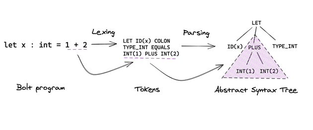

# SQL Parser Development Guide

The `parser` module is the foundational module of `sqlgpt-parser`. It parses SQL statements according to predefined SQL grammar rules, converting them from text into an abstract syntax tree (`AST`).

The `parser` module in `sqlgpt-parser` is written using [PLY](https://github.com/dabeaz/ply). PLY is a Python tool for building lexical and parsing analyzers. It can analyze input text based on specified patterns and automatically compile the lexical and grammar rule files in the [sql-parser](../../sqlgpt_parser/sql_parser/) folder of the project before the program runs, generating executable code.

## Lexical Analysis and Syntax Analysis



Lexical analysis and syntax analysis are two steps in the parsing of SQL. The relationship between them is as follows: lexical analysis reads the user's input and converts it into tokens based on lexical rules. Syntax analysis then uses the tokens generated by lexical analysis as input and creates an abstract syntax tree based on syntax rules. In order to generate lexical analyzers and syntax analyzers that meet user requirements, users need to provide custom lexical rules and syntax rules. In PLY, lexical rules and syntax rules are defined using two different sets of rules.

### Lexical Rules

```python
import ply.lex as lex

tokens = (
   'NUMBER',
   'PLUS',
   'MINUS',
   'TIMES',
   'DIVIDE',
   'LPAREN',
   'RPAREN',
)

t_PLUS    = r'\+'
t_MINUS   = r'-'
t_TIMES   = r'\*'
t_DIVIDE  = r'/'
t_LPAREN  = r'\('
t_RPAREN  = r'\)'

def t_NUMBER(t):
	r'\d+'
	t.value = int(t.value)    
	return t

lexer = lex.lex()
```

In `PLY`, `tokens` are represented using regular expression rules. These rules need to start with `t_`, followed by a word that must correspond to a value in the `tokens` list.

For simple `tokens`, you can directly define them using regular expressions:

```python
t_PLUS=r'\+'
```

For complex `tokens`, you can define them as functions. When the input string matches the regular expression, the code inside the function will be executed. In the following function, the input will be converted to an integer and stored in `t.value`, and a `token` of type `NUMBER` will be returned:

```python
def t_NUMBER(t):
    r'\d+'
    t.value = int(t.value)    
    return t
```

### Syntax Rules

#### Basics of Syntax Analysis

```text
%left '+' '-'
%left '*' '/'
%%
expr:
        INTEGER
        | expr + expr         { $$ = $1 + $3; }
        | expr - expr         { $$ = $1 - $3; }
        | expr * expr         { $$ = $1 * $3; }
        | expr / expr         { $$ = $1 / $3; }
        | '(' expr ')'          { $$ = $2; }
```

The first part defines the associativity of `token` types and operators. All four operators are left-associative, and operators on the same line have the same precedence. Operators on different lines have higher precedence for those defined later.

The syntax rules are defined using BNF (Backus-Naur Form). BNF is used to express context-free languages, and most modern programming languages can be represented using BNF. The rules above define a production. The items on the left-hand side of the production rule (e.g., `expr`) are called non-terminals, while `INTEGER` and `+`, `-`, `*`, `/` are called terminals, which are tokens returned by the lexical analyzer.

The syntax analyzer generated by PLY uses a bottom-up shift-reduce parsing technique and uses a stack to store intermediate states. Here is the parsing process for the expression `1 + 2 * 3`:

```text
1    . 1 + 2 * 3
2    1 . + 2 * 3
3    expr . + 2 * 3
4    expr + . 2 * 3
5    expr + 2 . * 3
6    expr + expr . * 3
7    expr + expr * . 3
8    expr + expr * 3 .
9    expr + expr * expr .
10   expr + expr .
11   expr .
```

The actions associated with a rule are defined inside the curly braces on the right-hand side of a production rule. For example:

```text
expr:  expr '+' expr         { $$ = $1 + $3; }
```

We replace the items in the stack that match the right-hand side of the production rule with the left-hand side non-terminal of the production rule. In this example, we pop `expr '*' expr` from the stack and then push `expr` back onto the stack. We can access the items in the stack using the `$position` notation, where `$1` refers to the first item, `$2` refers to the second item, and so on. `$$` represents the top of the stack after the reduction operation. The action in this example pops three items from the stack, adds the two expressions, and pushes the result back onto the top of the stack.

#### Define syntax rules using PLY

```python
import ply.yacc as yacc

# Get the token map from the lexer.  This is required.
from calclex import tokens

precedence = (
    ('left', 'PLUS', 'MINUS'),
    ('left', 'TIMES','DIV'),
)

def p_expr(p):
  """expr : expr PLUS expr
  | expr MINUS expr
  | expr TIMES expr
  | expr DIV expr
  """
  if p.slice[2].type == 'PLUS':
    p[0]=p[1]+p[3]
  elif p.slice[2].type == 'MINUS':
    p[0]=p[1]-p[3]
  elif p.slice[2].type == "TIMES":
    p[0]=p[1]*p[3]
  elif p.slice[2].type == "DIV":
    p[0]=p[1]/p[3]

def p_expr_paren(p):
    """expr : LPAREN expr RPAREN"""
    p[0]=p[2]

def p_expr_number(p):
  """expr : NUMBER"""
  p[0]=p[1]

# Build the parser
parser = yacc.yacc()
```

`precedence` defines the associativity and precedence of `tokens`. As shown in the above example, the first element in the tuple represents the associativity of the `token`, where `left` indicates left associativity. `tokens` on the same line have the same precedence, and the precedence increases from bottom to top for tokens on different lines. In the given example, the `TIMES` and `DIV` have higher precedence than `PLUS` and `MINUS`.

Each syntax rule is defined as a method in Python, where the method's comments describe the corresponding context-free grammar, and the statements implement the semantic behavior of the rule. Each method takes a `p` parameter, which is a sequence containing the symbols of the current matched grammar. The correspondence between `p[i]` and the grammar symbols is as follows:

```python
def p_expr_paren(p):
    """expr : LPAREN expr RPAREN"""
    #   ^       ^      ^    ^
    #  p[0]    p[1]   p[2]  p[3]
    p[0] = p[2]
```

PLY uses the notation `p[position]` to access the stack, where `p[0]` corresponds to `$$` mentioned earlier, `p[1]` corresponds to `$1`, `p[2]` corresponds to `$2`, and so on. In this case, the action involves popping the top three elements from the stack, assigning the value of `p[2]` to `p[0]`, and then pushing it back onto the stack.

## Implementation of the `parser` for `sqlgpt-parser`

There are a total of three SQL parsers in `sqlgpt-parser`, located in the [mysql_parser](../../sqlgpt_parser/sql_parser/mysql_parser), [oceanbase_parser](../../sqlgpt_parser/sql_parser/oceanbase_parser), and [odps_parser](../../sqlgpt_parser/sql_parser/odps_parser) folders. Each of these folders contains three files: `lexer.py`, `reserved.py`, and `parser.py`.

The `lexer.py` and `reserved.py` files are both used for lexical analysis. In `reserved.py`, SQL keywords are defined and stored in two variables: `reserved` and `nonreserved`. The `reserved` variable contains all the keywords that cannot be used as column names, table names, or aliases in SQL. On the other hand, `nonreserved` contains keywords that can be used as column names, table names, or aliases.

In `lexer.py`, there are two sections. The `tokens` variable defines all the tokens that can be used in the parser. Here, the SQL keywords from `reserved.py` are imported and converted into tokens that the parser can recognize and use.

```python
tokens = (
    [
        'IDENTIFIER',
        'DIGIT_IDENTIFIER',
       ...
    ]
    + list(reserved)
    + list(nonreserved)
)
```

The remaining sections define what `token` the user input will be converted into.

```python
...
t_BIT_MOVE_LEFT = r'<<'
t_BIT_MOVE_RIGHT = r'>>'
t_EXCLA_MARK = r'!'

def t_DOUBLE(t):
    r"[0-9]*\.[0-9]+([eE][-+]?[0-9]+)?|[-+]?[0-9]+([eE][-+]?[0-9]+)"
    if 'e' in t.value or 'E' in t.value or '.' in t.value:
        t.type = "FRACTION"
    else:
        t.type = "NUMBER"
    return t
...
```

As mentioned earlier, simple tokens are defined directly using regular expressions. The values that match the regular expressions are converted into tokens with a prefix `t_`. Complex tokens, on the other hand, are defined using methods. For example, in `t_DOUBLE`, the incoming value is further examined. If it is a decimal number, the token value is set to `FRACTION`. If it is not a decimal number, it is set to `NUMBER`.

The `parser.py` file is also divided into two sections. `precedence` defines the priority and associativity of tokens. The remaining sections define the corresponding grammar rules and their associated actions.

```python
precedence = (
    ('right', 'ASSIGNMENTEQ'),
    ('left', 'PIPES', 'OR'),
    ('left', 'XOR'),
    ('left', 'AND', 'ANDAND'),
    ('right', 'NOT'),
   ...
    ('left', 'EXCLA_MARK'),
    ('left', 'LPAREN'),
    ('right', 'RPAREN'),
)
```

`right` and `left` in the tuple indicate whether the `token` is right-associative or left-associative, and the priority is arranged from low to high. In the example above, `RPAREN` has the highest priority, while `ASSIGNMENTEQ` has the lowest priority.

The grammar rules of SQL are quite complex, and most of the content in `parser.py` is dedicated to defining these rules. The grammar rules for SQL can be referenced from the corresponding database's documentation. For example, for the MySQL database, you can refer to the [SQL Statements](https://dev.mysql.com/doc/refman/8.0/en/sql-statements.html) section of its reference manual. The syntax definition for the `DELETE` statement in MySQL is as follows:

```python
def p_delete(p):
    r"""delete : DELETE FROM relations where_opt order_by_opt limit_opt
    | DELETE FROM relations partition where_opt order_by_opt limit_opt
    | DELETE table_name_list FROM relations where_opt order_by_opt limit_opt
    | DELETE table_name_list FROM relations partition where_opt order_by_opt limit_opt
    | DELETE FROM table_name_list USING relations where_opt order_by_opt limit_opt
    | DELETE FROM table_name_list USING relations partition where_opt order_by_opt limit_opt
    """
    length=len(p)
    p_limit = p[length-1]
    if p_limit is not None:
        offset,limit = int(p_limit[0]),int(p_limit[1])  
    else:
        offset,limit=0,0
    if p.slice[3].type=="relations":
        tables,table_refs=p[3],None
    elif p.slice[2].type=="table_name_list":
        tables,table_refs=p[4],p[2]
    else:
        tables,table_refs=p[3],p[5]
    p[0] = Delete(table=tables,table_refs=table_refs,where=p[length-3], order_by=p[length-2], limit=limit, offset=offset)
```

The comment in `p_delete` corresponds to the syntax rule for the `DELETE` statement. When the input satisfies the syntax rule, the function in the method is called to construct an `AST` node for the `DELETE` statement.

Once the grammar rules are written, they can be used to parse SQL statements. Taking `mysql_parser` as an example, you can use this grammar rule for parsing SQL statements.

```python
from sqlgpt_parser.sql_parser.mysql_parser import parser as mysql_parser

sql = "DELETE FROM t WHERE a=1"
result = mysql_parser.parse(sql)
```

The execution result is shown in the following diagram, which depicts the execution plan tree for the SQL statement.


## References

* [TiDB 源码阅读系列文章（五）TiDB SQL Parser 的实现](https://cn.pingcap.com/blog/tidb-source-code-reading-5)
* [PLY](https://github.com/dabeaz/ply)